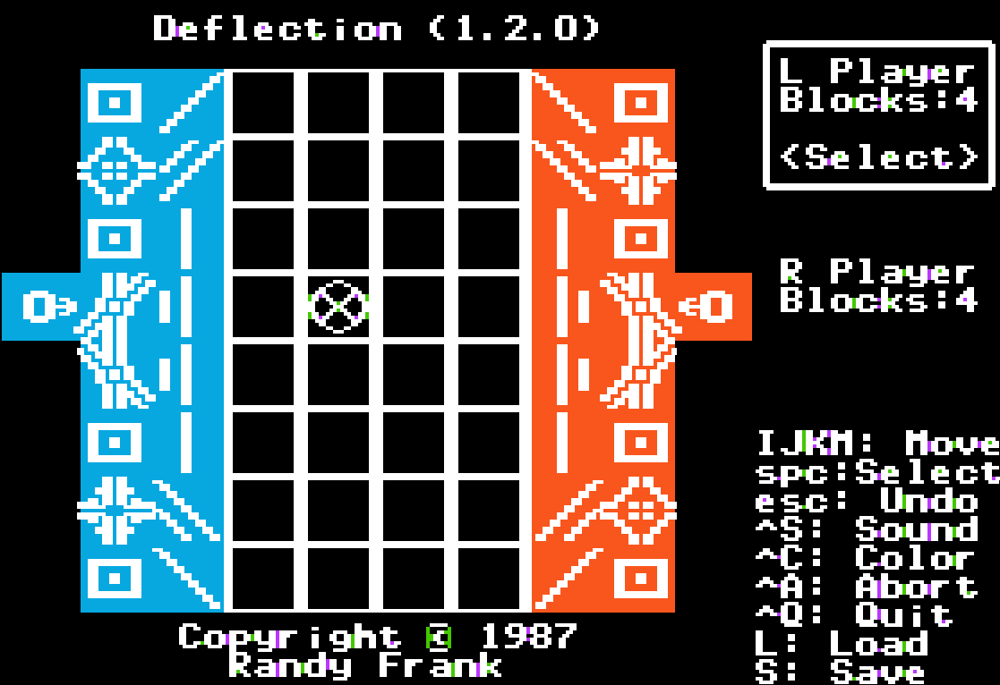

Deflection
==========
|MIT| |APPLE| |Itch|

.. |MIT| image:: https://img.shields.io/badge/License-MIT-yellow.svg
   :target: https://opensource.org/licenses/MIT

.. |APPLE| image:: https://img.shields.io/badge/Apple%20II-ProDOS-0000C0.svg?logo=apple&logoColor=ee0000
   :target: https://github.com/AppleWin/AppleWin

.. |Itch| image:: https://img.shields.io/badge/Itch.io-fa5c5c.svg
   :target: https://myleftgoat.itch.io/deflection

Overview
--------
This is an old board game written back in 1986 for the Apple II.  Patterned after
chess and an old physical board game of the same name, the idea is to place
a collection of reflective panels, beam splitters and light-pipes to protect
your four 'key' blocks.  On each turn one can move one piece any number of 
unblocked squares north, south, east or west and then rotate the piece.
Alternatively, a player may opt to move and fire a laser from the back row.
If a laser hits a piece from an unprotected direction, the piece is destroyed.
Play continues back and forth until one player has lost all of their 'key'
blocks.

In 2024, the original source code to the game was unearthed and the original
programmer decided to fix up the project enough so that it was playable again.
The resulting source code is in this repo and one can download a generated
disk image from itch.io.

Details
-------
The game is written entirely in Merlin 6502 assembly.

There is a build script in this repo that is capable of generating a .2mg file 
from the sources.  It requires several tools to be installed:

- Python
- `Merlin32 Assembler <https://brutaldeluxe.fr/products/crossdevtools/merlin/>`_
- `CiderPress II <https://ciderpress2.com/>`_

If one places the CiderPress CLI in a subdirectory named 'ciderpress' (ciderpress/cp2.exe)
and places the Merlin package in a subdirectory named 'merlin32' 
(merlin32\\Windows\\Merlin32.exe), then the following commands will build
the `deflection.2mg` file:

.. code::

   python -m virtualenv venv
   .\venv\Scripts\activate.ps1
   python build.py

One can adjust the pathnames to CiderPress and Merlin at the top of the build.py file.

Documentation and Issues
------------------------
Gameplay is pretty simple.  A player selects a piece to move.  They can then move the
piece to another location (note: the piece may stay in the same location).  Once moved,
the piece may be rotated at the new location.  If the piece is the "gun" located just 
off the 8x8 board, once rotated, it is "fired".  The beam is tracked through the 
board, interacting with and potentially destroying other pieces.

Pieces (other than the gun) may be moved similar to a queen in chess.  Up, down and
diagonally any number of non-empty squares.  It may not move over any other pieces.
Other than the "block", they can be rotated at 90 degree increments. The gun piece
can only be moved vertically in the column just off the 8x8 board.  

Pieces can reflect fired beams 90 or 180 degrees.  Some pieces act like light-pipes,
redirecting the ray 45 degrees.  There are also two beam splitters which split an
incoming beam in the form of at 'T' or in the form of a 'Y'.  Both spit beams 
continue to travel independently. 

All pieces have vulnerable directions.  For example the flat reflector cannot be
hit edge on.  The 'block' piece cannot be hit from any direction.  There are diagonal 
or horizontal/vertical directional reflectors.  They may also have a 'backing' pad 
that makes the reflectors vulnerable from the back side.  If a splitter or light-pipe
is hit from a direction other than the input directions, they are also vulnerable.
If ray hits a piece from a vulnerable direction, it is destroyed.  

Game play continues back and forth until all of the block pieces have be destroyed
for a player.  Note, it is very possible for a player to destroy their own pieces
and therefore one can explicitly lose the game themselves.

Please feel free to post issues and other questions at `Deflection Issues
<https://github.com/randall-frank/deflection/issues>`_. This is the best place
to post questions and code.

The game is also hosted on `itch.io <https://myleftgoat.itch.io/deflection>`_ which provides
a simpler download option and forum to discuss more gameplay related issues.

Things To Do
~~~~~~~~~~~~
Currently, there is no provision for a computer player.  It would be nice to
include a way to play solo.

There is no mechanism to save/load a game during play.  This would be very
handy, especially while working on the computer player.

Probably more?

License
-------
`Deflection` is licensed under the MIT license.
